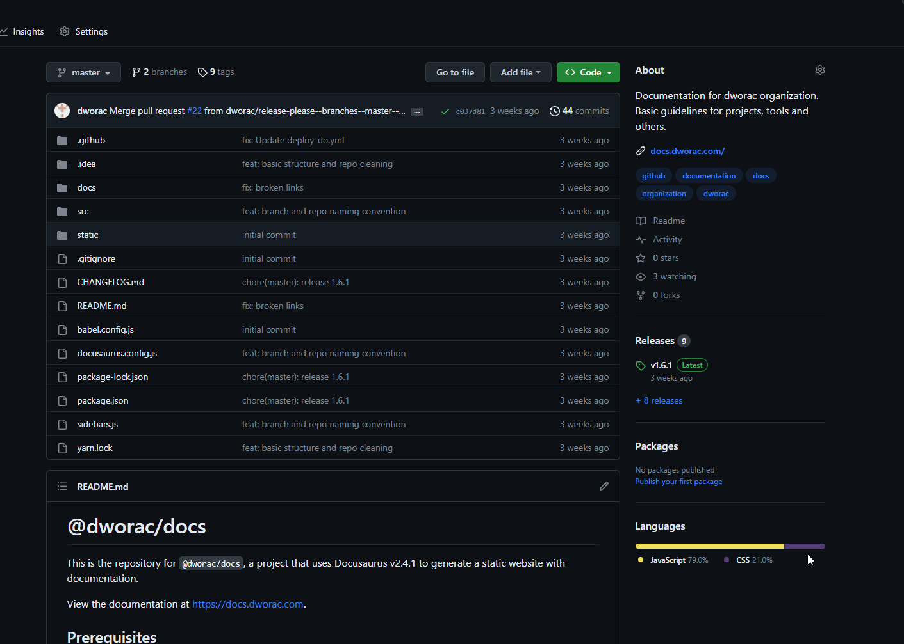

# Github Settings

:::note Auditing
In this document the following auditing rules are covered:

<code style={{backgroundColor:'#1abc9c', color: 'white', paddingLeft:10, paddingRight: 10}}>
DEV-DOC-012-v1
</code>
  
The description should be set in the repository settings.
  

<code style={{backgroundColor:'#1abc9c', color: 'white', paddingLeft:10, paddingRight: 10}}>
DEV-DOC-013-v1
</code>
  
The topics should be set in the repository settings.
  

<code style={{backgroundColor:'#1abc9c', color: 'white', paddingLeft:10, paddingRight: 10}}>
DEV-DOC-014-v1
</code>
  
The website should be set in the repository settings. If no website comes out from the repository you can set the website to the repository itself or to the package registry.
  

  
  

Check out all the rules in the <a href="/auditor/rules">Auditor Rules</a> section.
:::

There are some settings that should be configured in the repository settings. These settings are:

- Description: The description of a repository should be a brief summary of the purpose of the repository. It should be written in a way that is easy to understand for people who are not familiar with the project.
- Topics: Keywords are used to help people find your repository when searching for similar projects on GitHub. They should be relevant to the project and should be separated by commas.
- Website: The website field should contain a link to the project's website. This is useful for people who want to learn more about the project.

You can set the description, keywords, and website by clicking the gear icon in the top right corner of the repository's page and then filling in the fields.

